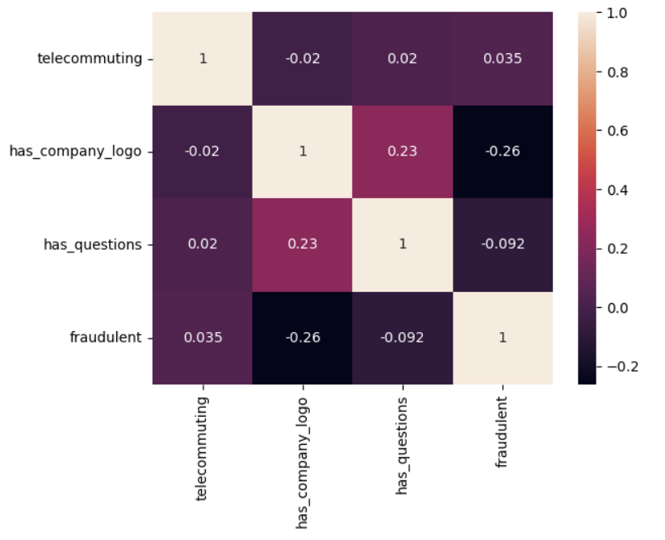

# UMBC-DATA606-Capstone

Fake Job Posting Detection Using NLP, LLM Embeddings, and Machine Learning

Prepared for: UMBC Data Science Master’s Degree Capstone
Instructor: Dr. Chaojie (Jay) Wang
Author: Charan Naga Sri Sai Satya Gannapureddy
GitHub Repo: https://github.com/satyaGannapureddy/UMBC-DATA606-Capstone

# 1. Title and Author

## Fake Job Posting Detection Using NLP and Machine Learning

Charan Naga Sri Sai Satya Gannapureddy

GitHub Repository: https://github.com/satyaGannapureddy/UMBC-DATA606-Capstone

LinkedIn: add your link

PowerPoint Presentation: add link

YouTube Presentation: add link

# 2. Background

Online job portals such as LinkedIn, Indeed, and Naukri are increasingly targeted by scammers who post fraudulent job listings. These scams steal personal information or money and cause significant harm to job seekers.

This project uses NLP, Machine Learning, and LLM embeddings to automatically detect fraudulent job postings by analyzing text and metadata.

## Why This Problem Matters

Prevents identity theft and financial loss

Protects job seekers from scams

Helps job portals auto-flag suspicious listings

Improves trust in online recruitment ecosystems

## Research Questions

Can fake job postings be accurately classified using ML and NLP?

Do LLM embeddings outperform TF-IDF?

Which machine learning model performs best?

What textual/metadata features best indicate fraud?

# 3. Data

## 3.1 Data Source

Dataset: Real or Fake Job Posting Prediction

Source: Kaggle

Link: https://www.kaggle.com/shivamb/real-or-fake-fake-jobposting-prediction

## 3.2 Dataset Description

Size: ~17 MB

Shape: 17,880 rows × 18 columns

Unit of Observation: Each row represents one job posting

## 3.3 Data Structure

Includes:

Text fields: title, description, requirements, company_profile, benefits

Categorical fields: employment_type, salary_range, department

Binary metadata: telecommuting, has_company_logo, has_questions

Target label: fraudulent (1 = fake posting)

## 3.4 Data Dictionary (Key Variables)
| **Column Name**      | **Type**     | **Description**                                     |
| -------------------- | ------------ | --------------------------------------------------- |
| **title**            | text         | Job title                                           |
| **location**         | text         | Geographic location of the job                      |
| **company_profile**  | text         | Description of the hiring company                   |
| **description**      | text         | Main body text describing the job                   |
| **requirements**     | text         | Required skills, qualifications, and experience     |
| **benefits**         | text         | Benefits offered by the employer                    |
| **telecommuting**    | binary (0/1) | Whether the job is remote (1 = yes, 0 = no)         |
| **has_company_logo** | binary (0/1) | Whether the posting includes a company logo         |
| **has_questions**    | binary (0/1) | Whether screening questions were included           |
| **employment_type**  | categorical  | Nature of employment (FT, PT, Contract, Temporary)  |
| **salary_range**     | categorical  | Salary information provided in text format          |
| **fraudulent**       | binary (0/1) | **Target variable**: 1 = Fake job posting, 0 = Real |

### Target Variable
fraudulent
  + Binary classification label

   + 1 = Fake job posting

   + 0 = Real job posting

### Selected Features

The following features were used to build the machine learning models:

#### 1. Combined Cleaned Text

A unified text field created by merging and preprocessing:

+ title

+ company_profile

+ description

+ requirements

+ benefits

This text was later converted into:

+ TF-IDF vectors (for classical models)

+ LLM embeddings (MiniLM-L6-v2)

#### 2. Metadata Features

These binary and numeric fields provide structural information:

+ telecommuting

+ has_company_logo

+ has_questions

#### 3. One-Hot Encoded Categorical Variables

Converted into numerical format to support ML models:

+ employment_type

+ salary_range

+ department

+ industry

+ required_education

+ required_experience

+ function

+ country (from location)

# 4. Exploratory Data Analysis (EDA)

The exploratory data analysis was performed in Jupyter Notebook to understand the structure, quality, and behavior of the Fake Job Posting dataset before applying machine learning. The dataset contains 17,880 job postings with 18 columns, including text fields, categorical variables, and binary indicators. For analysis, we focused on the target variable fraudulent and a selected set of features such as description, title, company_profile, requirements, benefits, telecommuting, has_company_logo, has_questions, employment_type, salary_range, required_experience, required_education, industry, and function. These variables were retained because they provide meaningful signals for fraud detection, while unrelated identifiers were dropped.

Initial summary statistics revealed that real job postings tend to contain longer, richer text descriptions, while fake postings often provide vague or short descriptions. Binary metadata showed useful patterns: for example, fake postings rarely include company logos, and they also tend not to ask screening questions, suggesting weaker legitimacy signals. Categorical variables such as job function, industry, and employment type exhibited substantial imbalance, and many missing entries were consolidated under “Unknown” to maintain data integrity.

Data cleaning involved handling missing values—text fields were filled with empty strings, and categorical fields were assigned “Unknown.” Duplicate rows were checked and removed when present. No merging, pivoting, or external datasets were required because the dataset is self-contained for the prediction task. The location field was split to extract the country component, enabling basic geographic distribution analysis. After preprocessing, the dataset was made “tidy”: each row represents a single job posting, and each column represents one unique attribute of that posting.

Text preprocessing included lowercasing, removing punctuation, removing stopwords, tokenizing, and lemmatizing. A combined cleaned text feature was created by merging multiple text fields (title, description, requirements, etc.), which was later vectorized using TF-IDF and LLM embeddings.

Below are the visualizations included as part of EDA:

#### Class Imbalance

Fake postings make up only about 4.8% of all listings, indicating a strong class imbalance that requires oversampling (SMOTE).

#### Binary Metadata Distributions

These plots show that fake postings rarely include company logos and often skip screening questions, whereas legitimate postings usually provide them.

#### Job Function Distribution

The majority of postings belong to “Unknown” or broad categories like IT and Sales; many categories appear infrequently.

#### Correlation Heatmap

The heatmap shows that has_company_logo has a noticeable negative correlation with fraud, while has_questions has a slight positive association with real postings.

#### Country Distribution

Most postings originate from the US, followed by GB and GR; other countries appear sparsely.

#### Word Count in Job Descriptions

Real postings generally contain longer descriptions compared to fake postings, which helps models differentiate them.

#### Character Count in Job Descriptions

Real postings show a wide spread of character counts, while fake postings cluster at low values.

#### Word Cloud of Common Terms

The word cloud reveals recurring words such as communication, experience, customer service, and full time, suggesting typical job-related terminology.

# 5. Model Training
To build a predictive system for identifying fake job postings, several machine learning models were trained and evaluated using both traditional NLP representations and modern embedding-based techniques. The initial stage involved preparing the dataset by performing text preprocessing (normalization, stopword removal, lemmatization) and converting text into numerical form using TF-IDF vectorization. Classical models such as Naive Bayes, K-Nearest Neighbors (KNN), Logistic Regression, Random Forest, and XGBoost were then trained on this representation. The dataset was split using an 80/20 stratified train–test split to maintain the proportion of fraudulent postings in both sets, ensuring fair and consistent evaluation.

Python libraries including scikit-learn, NLTK, spaCy, XGBoost, pandas, NumPy, and Matplotlib were used for preprocessing, modeling, and visualization. All model development was carried out in a Jupyter Notebook environment running locally. After observing limitations in TF-IDF models—particularly in detecting the minority (fraudulent) class—the pipeline was extended using SentenceTransformer embeddings (all-MiniLM-L6-v2). This embedding model generates 384-dimensional contextual vectors that capture richer semantic meaning compared to TF-IDF.

##### Comparison of Model Accuracies (TF-IDF Models)

These embeddings, combined with metadata features, were then used to train Logistic Regression, Random Forest, and XGBoost again. This yielded dramatically improved performance across almost every metric compared to TF-IDF models.

To better understand how each model performed internally, confusion matrix components (TP, FP, TN, FN) were analyzed to quantify how often models correctly identified fraudulent postings versus how often they missed them.

##### Confusion Matrix Components Comparison (TF-IDF Models)

Model evaluation relied on metrics appropriate for imbalanced classification, including precision, recall, F1-score, accuracy, macro-averages, and confusion matrix interpretation. The TF-IDF models achieved reasonable accuracy (0.86–0.89), but their ability to identify fraudulent postings was weak—F1-scores for class 1 were often below 0.40.

When LLM embeddings were introduced, performance increased significantly. Logistic Regression and Random Forest with embeddings achieved accuracies around 0.97, while LLM + XGBoost emerged as the best model, reaching 97.53% accuracy, 0.829 macro-F1, and the strongest balance between detecting real and fraudulent postings.

##### Accuracy by Model (LLM Embeddings)

Through systematic experimentation, visual comparison, and metric-driven evaluation, embedding-based XGBoost was selected as the final model due to its superior balance of precision, recall, F1-score, and overall accuracy.

##### Macro-F1 by Model (LLM Embeddings)

 

The macro-F1 visualization further demonstrated that LLM-based models perform more consistently across both classes.
The confusion matrices for all three LLM-based models clearly show significantly fewer false negatives and more reliable identification of fraudulent postings.

# 6. Application of the Trained Model

## 6.1 Streamlit Web App

A real-time Streamlit app was created.

Users can:

Paste a job description

Model preprocesses & embeds text

XGBoost predicts fraud probability

App displays classification + confidence

## 6.2 Use Cases

Job portals (auto-flag risky postings)

Universities (protect students from scam listings)

Recruiters (validate external postings)

Job seekers (self-check job authenticity)

# 7. Conclusion
Summary of Results

Machine learning can accurately identify fake job postings

LLM embeddings significantly improved accuracy

XGBoost was the best-performing model

Textual content is the strongest predictor

Limitations

Dataset may not reflect current scam trends

Only English-language data used

No deep transformer fine-tuning due to compute limits

Lessons Learned

Importance of class balancing (SMOTE)

Advantages of LLM embeddings in NLP tasks

Need for thorough preprocessing

Streamlit enables fast, simple deployment

Future Work

Use BERT / RoBERTa for deeper semantic understanding

Add model explainability (SHAP, LIME)

Deploy via REST API

Expand dataset via live scraping

Add multilingual support

# 8. References

Kaggle Fake Job Posting Dataset

Scikit-learn Documentation

SentenceTransformers Documentation

XGBoost Documentation

Imbalanced-Learn (SMOTE)

Research papers on job scam detection
